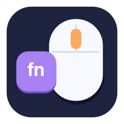

# MiddleClicker



**A real middle mouse button for your Mac's trackpad. Hold Fn, then click or drag.**

MiddleClicker is a free, open-source macOS menu-bar app under the [MIT License](LICENSE). Use middle-button navigation in Blender, Maya, CAD tools, and other apps without carrying a separate three-button mouse.

**[Download the latest macOS release](https://github.com/fordft/MiddleClicker/releases/latest)**

## Why MiddleClicker?

A Mac trackpad does not provide a dedicated middle mouse button. That makes common 3D navigation gestures inconvenient: orbiting a Blender viewport, panning with Shift + middle drag, or using Alt + middle drag in applications such as Maya.

MiddleClicker turns **Fn + left click** into middle click, and **Fn + left drag** into a continuous middle-button drag. With macOS tap-to-click enabled, Fn + Tap works too.

## What's new in 2.0

- **Reliable physical Fn detection.** It reads the keyboard's Fn/Globe values directly, rather than depending on modifier flags that other apps may clear.
- **Proper mouse-event preservation.** Relative movement, modifiers, pressure, click count, position, timestamp, and targeting metadata survive conversion. This matters for responsive 3D navigation.
- **Complete gestures.** A gesture stays a middle-button drag until you release the click, even if you release Fn first.
- **Interruption recovery.** The app releases an owned middle button on pause, normal quit, sleep, and event-tap interruption. It re-enables the tap when macOS temporarily disables it.
- **Native menu-bar controls.** Pause, inspect permission status, open settings, test middle click, manage startup, and quit.
- **Built-in test window.** Confirm that the app receives a middle click, drag, and release before using it in a 3D application.
- **Automatic Launch at Login**, enabled on the first launch from Applications.
- **New icon and drag-and-drop installer.** One universal download for Apple Silicon and Intel.

## Install

1. Download **MiddleClicker-2.0.0-universal.dmg** from [Releases](https://github.com/fordft/MiddleClicker/releases/latest).
2. Open the disk image and drag **MiddleClicker** into **Applications**.
3. Open MiddleClicker from Applications once.
4. Enable **MiddleClicker** in **System Settings → Privacy & Security → Accessibility**.
5. Enable **MiddleClicker** in **Privacy & Security → Input Monitoring**.

If macOS asks, choose **Quit & Reopen**. Reopen MiddleClicker from Applications if it does not reopen itself. Both permission pages are available from the menu-bar icon.

**Accessibility** allows the app to convert mouse events. **Input Monitoring** allows it to read the physical Fn key. The app stays open while permission is missing and shows which step is needed.

### First-launch security notice

This release is **ad hoc signed and not notarized with an Apple Developer ID**. If macOS blocks it and you choose to allow the app, use **System Settings → Privacy & Security → Open Anyway**, following [Apple's instructions](https://support.apple.com/guide/mac-help/mh40616/mac).

## Use

| Gesture | Result |
| --- | --- |
| Fn + left click | Middle click |
| Fn + left click and drag | Middle-button drag |
| Fn + tap | Middle click, when macOS tap-to-click is enabled |
| Shift + Fn + drag | Middle drag with Shift preserved |
| Option + Fn + drag | Middle drag with Option/Alt preserved |
| Normal left click | Unchanged |

Open **Test Middle Click** from the mouse + **MC** menu-bar icon. The test area shows when it receives middle-button down, drag, and release. Try a normal click as well to confirm that ordinary clicks stay ordinary.

Navigation actions depend on the target application's keymap. MiddleClicker sends the center mouse button; the application chooses what to do with it.

### Automatic startup

**Launch at Login** is enabled automatically on the first launch from Applications, using the native macOS login-item service. MiddleClicker opens when you sign in after restarting your Mac. You can turn it off from the app's menu.

If macOS requires approval for the login item, select **Open Login Items Settings** from the menu and allow MiddleClicker. No installer script or Terminal command is needed for normal installation.

## Requirements

- macOS **13 Ventura or later**.
- Apple Silicon or Intel Mac; the universal app includes both architectures.
- A keyboard that reports the Apple **Fn/Globe** key to macOS.
- Accessibility and Input Monitoring permission.

Many third-party keyboards handle Fn internally and do not send it to the Mac. Use the Mac's built-in keyboard or a compatible keyboard in that case. This app uses Fn + click; it does not implement a three-finger middle-click gesture.

## Privacy

The mouse event tap handles left-button down, drag, and up events. The keyboard input queue contains only Apple Fn elements. No typed text, audio, screen content, or input history is collected. There is no account, subscription, telemetry, or background network connection.

A small local log records startup, pause, quit, and errors. Runtime state is stored under `~/Library/Application Support/MiddleClicker`. The test window's drawing stays in memory and is never uploaded or saved.

## Upgrade from version 1

1. Quit the old MiddleClicker from its menu-bar icon.
2. Replace it in Applications with the new app and reopen it.
3. Check Accessibility again and enable the new **Input Monitoring** requirement.

The original bundle identifier is preserved. macOS may still ask for renewed permission because an ad hoc signed update changes its code signature. If a permission looks enabled but remapping does not work, reopen the app and reapprove that permission in System Settings if necessary.

## Troubleshooting

- **Clicks stay left clicks:** Confirm both permissions, ensure the app is enabled, and open Test Middle Click. The menu reports permission or keyboard problems.
- **Fn + Tap does nothing:** Enable tap-to-click in macOS Trackpad settings, or use a physical click.
- **Dragging works differently in an app:** Check that app's navigation keymap and required Shift/Option/Control modifiers.
- **The menu shows no physical Fn keyboard:** Use a keyboard that reports the Apple Fn/Globe usage. Keyboard-remapping tools that seize the physical device can also affect detection.
- **The app disappeared after granting permission:** Reopen it from Applications.
- **Using it alongside Fn Mute:** Both can read the physical Fn key. Fn Mute will mute audio while MiddleClicker converts Fn + left-click gestures.

To uninstall, turn off **Launch at Login**, quit MiddleClicker, and move the app to Trash.

## Build from source

Install Xcode or the Xcode Command Line Tools, then run:

```sh
git clone https://github.com/fordft/MiddleClicker.git
cd MiddleClicker
python3 scripts/test.py
python3 scripts/build.py
```

The universal app is created at `dist/MiddleClicker.app`. `./build.sh` remains a shortcut for building the app. The app has no third-party runtime dependencies.

To package and verify the DMG, ZIP, and checksums:

```sh
python3 -m venv .venv
.venv/bin/python -m pip install -r scripts/requirements-build.txt
.venv/bin/python scripts/package_release.py
python3 scripts/verify_release.py
```

Tests create mouse events in memory without posting them or reading your keyboard. They check gesture pairing, preserved movement and modifiers, early Fn release, interrupted-drag cleanup, normal clicks, and physical Fn state. GitHub Actions tests, builds both architectures, and verifies the downloadable packages.

The editable icon drawing is in `Assets/Icon.swift`. Run `python3 scripts/regenerate_icon.py` to rebuild the icon assets. To preview the test window without enabling mouse remapping, run `dist/MiddleClicker.app/Contents/MacOS/MiddleClicker --preview-test-window`.

### Signing and notarization

Maintainers with a Developer ID Application certificate can set `MIDDLECLICKER_SIGNING_IDENTITY` before building. Set `MIDDLECLICKER_NOTARY_PROFILE` to an existing `notarytool` Keychain profile before packaging to notarize and staple the app and disk image. Keep signing keys and credentials out of the repository. See [Apple's distribution documentation](https://developer.apple.com/documentation/security/notarizing-macos-software-before-distribution).

## License

[MIT](LICENSE). Free to use, modify, and share under the license's terms.
